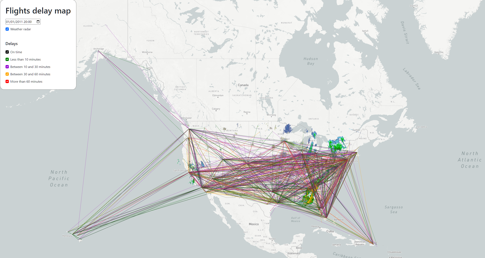

# Flight delays map

An interactive map displaying US flight delays and weather radar. Visualisation  shows how can various weather events impact US flight delays.

## Setup

The project has to be run using a web server.

## Usage

Initial visualisation displays airplanes that were flying on 01/01/2011 at 20:00 and a corresponding weather radar image. Users can select a different date & time using a date picker. Weather radar images can be toggled on and off.
Flights can be filtered by delay range. Filter's checkbox color corresponds to the drawn airplane line.  
Available delay filter ranges:

- on time (black),
- less than 10 minutes (green),
- between 10 and 30 minutes (violet),
- between 30 and 60 minutes (orange),
- more than 60 minutes (red).

